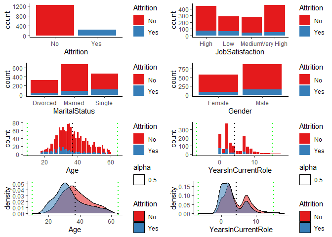

IBM employees predictions
================
Karol Roszak
5/5/2021

# Reading and preprocessing

### Reading raw data

General raw data characteristics description: There are 35 attributes
within them one classification target attribute: “Attretion” (in polish
“Wypalenie”) Meaning that the data serves the purpose of finding out
if given employee is eternally fed up with his work and cannot stand it
anymore (positive value) or is fine (negative value)

Data set attributes description:

  - 18 Qualitative
      - 4 Nominal
      - 4 Binary (counting target attribute)
      - 10 Ordinal
  - 17 Quantitative
      - 15 Discrete
      - 2 Continuous

Additionally there were no missing values found, in case there were some
we would use strict approach and get rid of instances with missing
entries unless other tactic would be necessary e.g. when we would have
to delete considerably big part of data set.

``` r
# Reading raw data and entry preprocessing

raw_data = read.csv("data/raw_data.csv")
raw_data = na.omit(raw_data) # strict policy for missing values

# Reshaping raw data and saving it to inspect in Weka (moving target attribute at the end)

raw_weka_data = raw_data %>% relocate(Attrition, .after=YearsWithCurrManager)
write.csv(raw_weka_data, "data/raw_weka_data.csv", row.names = FALSE)
```

After inspecting each attribute in Weka application we found out those,
which can be viewed as irrelevant or useless, specifically:

  - **EmployeeCount** - Discrete attribute with only one value for all
    instances
  - **EmployeeNumber** - Discrete attribute with different value for
    each instance
  - **Over18** - Binary attribute with one value for each instance
  - **StandardHours** - Discrete attribute with the same value for each
    instance

Chart interpretation informations:

  - black dotted line stands for mean value
  - green dotted lines stands for mean +/- 3\*standard deviation

<!-- -->

### Data preprocessing

Preprocessing stage begins with removal of previously mentioned
irrelevant attributes. Also, for making data more human readable we
decided to rename some Ordinal attributes values from categorical (but
numeric) to their actual meaning, this procedure concerns:

  - **Education**
  - **EnvironmentSatisfaction**
  - **JobInvolvement**
  - **JobSatisfaction**
  - **PerformanceRating**
  - **RelationshipSatisfaction**
  - **WorkLifeBalance**

<!-- end list -->

``` r
# Dropping irrelevant attributes

preprocessed_data = raw_weka_data %>%
  select(-EmployeeCount) %>%
  select(-EmployeeNumber) %>%
  select(-Over18) %>%
  select(-StandardHours)

# Renaming some categorical attributes name conceptions

preprocessed_data = preprocessed_data %>% 
  mutate(Education=recode(Education,
                                 `1` = 'Below College',
                                 `2` = 'College',
                                 `3` = 'Bachelor',
                                 `4` = 'Master',
                                 `5` = 'Doctor')) %>%
  mutate(EnvironmentSatisfaction = recode(EnvironmentSatisfaction,
                                 `1` = 'Low',
                                 `2` = 'Medium',
                                 `3` = 'High',
                                 `4` = 'Very High')) %>%
  mutate(JobInvolvement = recode(JobInvolvement,
                                 `1` = 'Low',
                                 `2` = 'Medium',
                                 `3` = 'High',
                                 `4` = 'Very High')) %>%
  mutate(JobSatisfaction = recode(JobSatisfaction,
                                  `1` = 'Low',
                                 `2` = 'Medium',
                                 `3` = 'High',
                                 `4` = 'Very High')) %>%
  mutate(PerformanceRating = recode(PerformanceRating,
                                 `1` = 'Low',
                                 `2` = 'Good',
                                 `3` = 'Excellent',
                                 `4` = 'Outstanding')) %>%
  mutate(RelationshipSatisfaction = recode(RelationshipSatisfaction,
                                 `1` = 'Low',
                                 `2` = 'Medium',
                                 `3` = 'High',
                                 `4` = 'Very High')) %>%
  mutate(WorkLifeBalance = recode(WorkLifeBalance,
                                 `1` = 'Bad',
                                 `2` = 'Good',
                                 `3` = 'Better',
                                 `4` = 'Best'))

# Renaming "ï..Age" attribute to just "Age", the rest is fine

preprocessed_data = rename(preprocessed_data, replace = c("ï..Age" = "Age"))

# Saving early preprocessed data set

write.csv(preprocessed_data, "data/preprocessed_data.csv", row.names = FALSE)
```

Inspecting some exemplary attributes in the data set

<!-- -->

# Finding correlations in data

# Taking care of outliers in data
