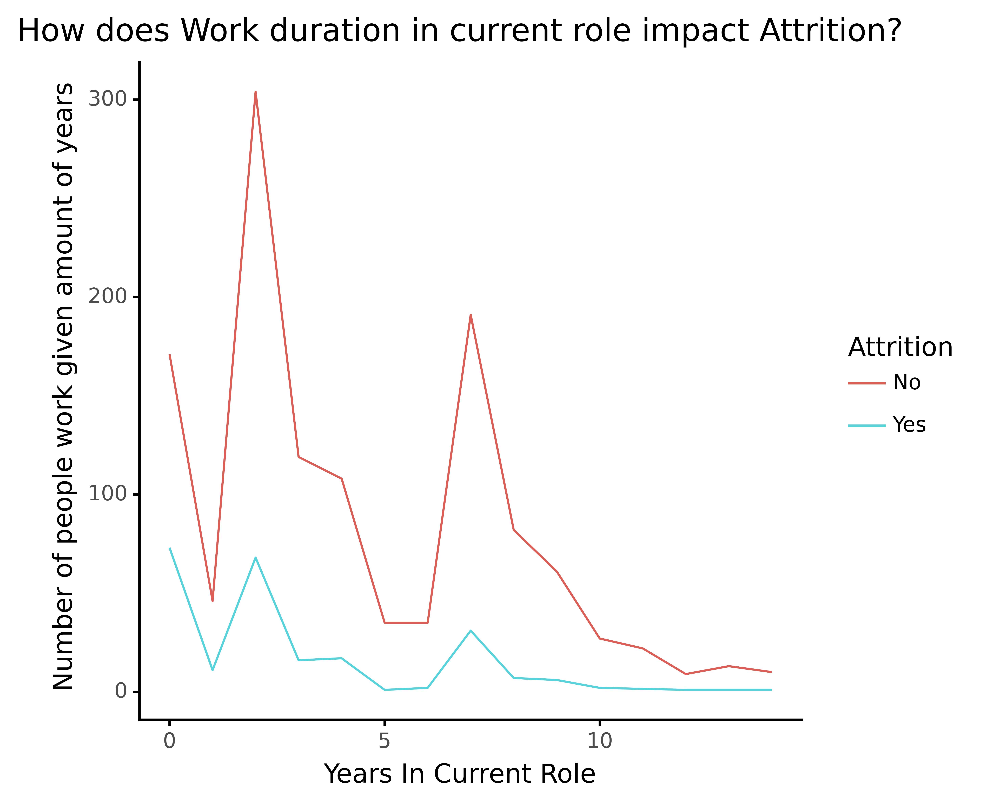
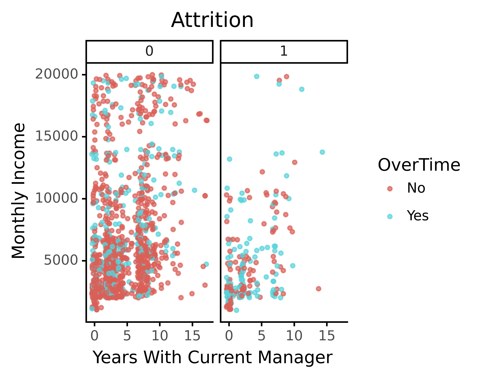
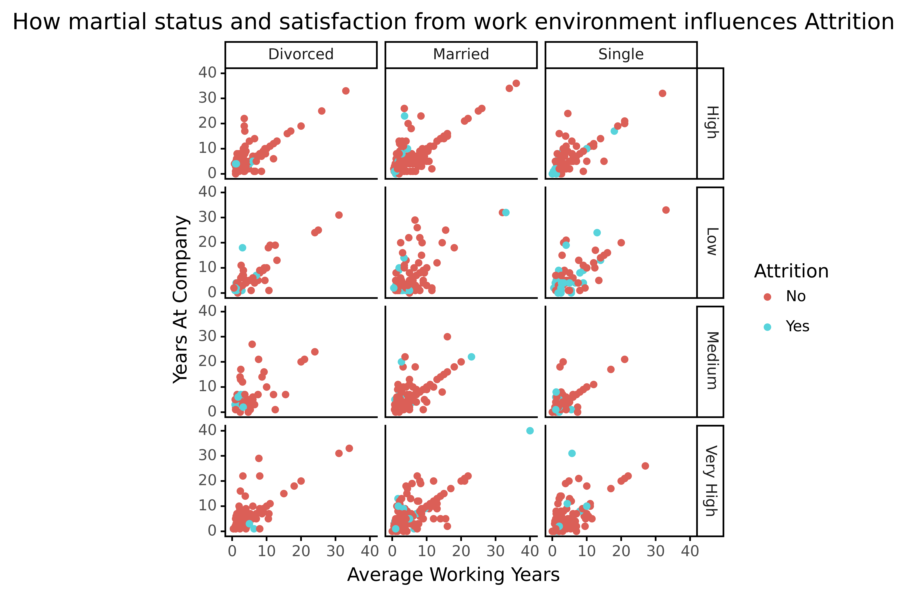

```{r setup, include=FALSE}
knitr::opts_chunk$set(echo = TRUE)
```

```{r imports, echo=FALSE, message=FALSE, warning=FALSE}
library(knitr)
library(dplyr)
library(ggplot2)
library(tidyr)
library(reactable)
library(plyr)
library(gridExtra)
library(reticulate)
library(htmltools)

set.seed(05052021)
```

1. [Reading and preprocessing](#read)
2. [Finding correlations in data ](#cor)
3. [Taking care of outliers in data](#out)
4. [Exploring the data](#exp)

# Reading and preprocessing  <a name="read"></a>

### Reading raw data

General raw data characteristics description:
There are 35 attributes within them one classification target attribute: "Attretion" (in polish "Wypalenie")
Meaning that the data serves the purpose of finding out if given employee is eternally fed up with his work
and cannot stand it anymore (positive value) or is fine (negative value)

Data set attributes description:

* 18 Qualitative
  + 4 Nominal
  + 4 Binary (counting target attribute)
  + 10 Ordinal
* 17 Quantitative
  + 15 Discrete
  + 2 Continuous
      
Additionally there were no missing values found, in case there were some
we would use strict approach and get rid of instances with missing entries 
unless other tactic would be necessary e.g. when we would have to delete considerably
big part of data set.


```{r reading_data, echo=TRUE}
# Reading raw data and entry preprocessing

raw_data = read.csv("data/raw_data.csv")
raw_data = na.omit(raw_data) # strict policy for missing values

# Reshaping raw data and saving it to inspect in Weka (moving target attribute at the end)

raw_weka_data = raw_data %>% relocate(Attrition, .after=YearsWithCurrManager)
write.csv(raw_weka_data, "data/raw_weka_data.csv", row.names = FALSE)

```


After inspecting each attribute in Weka application we found out those, 
which can be viewed as irrelevant or useless, specifically:

* __EmployeeCount__ - Discrete attribute with only one value for all instances
* __EmployeeNumber__ - Discrete attribute with different value for each instance 
* __Over18__ - Binary attribute with one value for each instance
* __StandardHours__ - Discrete attribute with the same value for each instance

Chart interpretation informations:

+ black dotted line stands for mean value
+ green dotted lines stands for mean +/- 3*standard deviation

```{r first_glance, echo=FALSE, warning=F}

# Having first glance at each of the attributes revealed: 

irrelevant_attrs = c('EmployeeCount', 'EmployeeNumber', 'Over18', 'StandardHours')


#attributes(raw_weka_data)

#check = summary(raw_weka_data)
#check


######
#a = raw_weka_data %>% select(col_names[1])
#ve = unlist(a, use.names = FALSE)
#ve

#mean(ve)
#sd(ve)

for(i in 1:length(irrelevant_attrs)){

considered_column = raw_weka_data %>% select(irrelevant_attrs[i])
considered_column_vals = unlist(considered_column, use.names = FALSE)

#print(unique(raw_weka_data %>% select(irrelevant_attrs[i])))
  
plot_g =ggplot(raw_weka_data, aes_string(x = irrelevant_attrs[i])) +
          geom_histogram(stat = 'count', aes(fill=Attrition)) +
          geom_vline(xintercept = mean(considered_column_vals), linetype="dotted", size = 1, color = 'black') +
          geom_vline(xintercept = mean(considered_column_vals) + 3 * sd(considered_column_vals), linetype="dotted",  size = 1, color = 'green') +
          geom_vline(xintercept = mean(considered_column_vals) - 3 * sd(considered_column_vals), linetype="dotted",  size = 1, color = 'green') +
          scale_fill_brewer(palette = 'Set1') +
          theme_classic()

if (i == 1) {
  plot_1 = plot_g
} else if (i == 2) {
  plot_2 = plot_g
} else if (i == 3) {
  plot_3 = plot_g
} else if (i ==4) {
  plot_4 = plot_g
}

}


grid.arrange(plot_1, plot_2, plot_3, plot_4, ncol = 2)

```


### Data preprocessing

Preprocessing stage begins with removal of previously mentioned irrelevant attributes.
Also, for making data more human readable we decided to rename some Ordinal attributes
values from categorical (but numeric) to their actual meaning, this procedure concerns:

* __Education__
* __EnvironmentSatisfaction__
* __JobInvolvement__
* __JobSatisfaction__
* __PerformanceRating__
* __RelationshipSatisfaction__
* __WorkLifeBalance__


```{r preprocessing, echo=TRUE}
# Dropping irrelevant attributes

preprocessed_data = raw_weka_data %>%
  select(-EmployeeCount) %>%
  select(-EmployeeNumber) %>%
  select(-Over18) %>%
  select(-StandardHours)

# Renaming some categorical attributes name conceptions

preprocessed_data = preprocessed_data %>% 
  mutate(Education=recode(Education,
                                 `1` = 'Below College',
                                 `2` = 'College',
                                 `3` = 'Bachelor',
                                 `4` = 'Master',
                                 `5` = 'Doctor')) %>%
  mutate(EnvironmentSatisfaction = recode(EnvironmentSatisfaction,
                                 `1` = 'Low',
                                 `2` = 'Medium',
                                 `3` = 'High',
                                 `4` = 'Very High')) %>%
  mutate(JobInvolvement = recode(JobInvolvement,
                                 `1` = 'Low',
                                 `2` = 'Medium',
                                 `3` = 'High',
                                 `4` = 'Very High')) %>%
  mutate(JobSatisfaction = recode(JobSatisfaction,
                                  `1` = 'Low',
                                 `2` = 'Medium',
                                 `3` = 'High',
                                 `4` = 'Very High')) %>%
  mutate(PerformanceRating = recode(PerformanceRating,
                                 `1` = 'Low',
                                 `2` = 'Good',
                                 `3` = 'Excellent',
                                 `4` = 'Outstanding')) %>%
  mutate(RelationshipSatisfaction = recode(RelationshipSatisfaction,
                                 `1` = 'Low',
                                 `2` = 'Medium',
                                 `3` = 'High',
                                 `4` = 'Very High')) %>%
  mutate(WorkLifeBalance = recode(WorkLifeBalance,
                                 `1` = 'Bad',
                                 `2` = 'Good',
                                 `3` = 'Better',
                                 `4` = 'Best'))

# Renaming "ï..Age" attribute to just "Age", the rest is fine

preprocessed_data = rename(preprocessed_data, replace = c("ï..Age" = "Age"))

# Saving early preprocessed data set

write.csv(preprocessed_data, "data/preprocessed_data.csv", row.names = FALSE)
```

Inspecting some exemplary attributes in the data set 

```{r, echo=FALSE, warning=FALSE}
inspected_attrs = c('Attrition', 'JobSatisfaction', 'MaritalStatus', 'Gender', 'Age', 'YearsInCurrentRole')

for(i in 1:length(inspected_attrs)){

considered_column = preprocessed_data %>% select(inspected_attrs[i])
considered_column_vals = unlist(considered_column, use.names = FALSE)

#print(unique(preprocessed_data %>% select(inspected_attrs[i])))
  
if (i > 0 && i < 7) {
  plot_g =ggplot(preprocessed_data, aes_string(x = inspected_attrs[i])) +
          geom_histogram(stat = 'count', aes(fill=Attrition)) +
          geom_vline(xintercept = mean(considered_column_vals), linetype="dotted", size = 1, color = 'black') +
          geom_vline(xintercept = mean(considered_column_vals) + 3 * sd(considered_column_vals), linetype="dotted",  size = 1, color = 'green') +
          geom_vline(xintercept = mean(considered_column_vals) - 3 * sd(considered_column_vals), linetype="dotted",  size = 1, color = 'green') +
          scale_fill_brewer(palette = 'Set1') +
          theme_classic()
}

if (i >=5 ) {
  plot_g_v2 =ggplot(preprocessed_data, aes_string(x = inspected_attrs[i])) +
          geom_density(aes(fill=Attrition, alpha = 0.5)) +
          geom_vline(xintercept = mean(considered_column_vals), linetype="dotted", size = 1, color = 'black') +
          geom_vline(xintercept = mean(considered_column_vals) + 3 * sd(considered_column_vals), linetype="dotted",  size = 1, color = 'green') +
          geom_vline(xintercept = mean(considered_column_vals) - 3 * sd(considered_column_vals), linetype="dotted",  size = 1, color = 'green') +
          scale_fill_brewer(palette = 'Set1') +
          theme_classic()
}

if (i == 1) {
  plot_1 = plot_g
} else if (i == 2) {
  plot_2 = plot_g
} else if (i == 3) {
  plot_3 = plot_g
} else if (i ==4) {
  plot_4 = plot_g
} else if (i == 5){
  plot_5 = plot_g
  plot_5_v2 = plot_g_v2
} else if (i == 6) {
  plot_6 = plot_g
  plot_6_v2 = plot_g_v2
}

}


grid.arrange(plot_1, plot_2, plot_3, plot_4, plot_5, plot_6, plot_5_v2, plot_6_v2, ncol = 2)

```


```{r preprocessed_data_presentation, echo=FALSE, warning=FALSE}

# just a temporary table.....

#preprocessed_table = reactable(preprocessed_data, 
#      defaultColDef = colDef(
#      header = function(value) gsub(".", " ", value, fixed = TRUE),
#      cell = function(value) format(value),
#      align = "center",
#      headerStyle = list(background = "#edf8fb")
#    ),
#    defaultPageSize = 5,
#    bordered = TRUE,
#    highlight = TRUE,
#    filterable = TRUE,
#    searchable = TRUE,
#    resizable = TRUE
#    )

#preprocessed_table
#just a little change to test git account...

col_names = names(preprocessed_data)
#col_names
#col_names[1]

#col_names
i = 0
for(i in 1:31){

considered_column = preprocessed_data %>% select(col_names[i])
considered_column_vals = unlist(considered_column, use.names = FALSE)

#print(unique(preprocessed_data %>% select(col_names[i])))
  
plot_g =ggplot(preprocessed_data, aes_string(x = col_names[i])) +
          geom_histogram(stat = 'count', aes(fill=Attrition)) +
          geom_vline(xintercept = mean(considered_column_vals), linetype="dotted", size = 1, color = 'black') +
          geom_vline(xintercept = mean(considered_column_vals) + 3 * sd(considered_column_vals), linetype="dotted",  size = 1, color = 'green') +
          geom_vline(xintercept = mean(considered_column_vals) - 3 * sd(considered_column_vals), linetype="dotted",  size = 1, color = 'green') +
          scale_fill_brewer(palette = 'Set1') +
          theme_bw()

#geom_ribbon( aes(xmin = mean(considered_column_vals) - 3 * sd(considered_column_vals), xmax= mean(considered_column_vals) + 3 * sd(considered_column_vals), ymin = 0, ymax = 20, fill = Attrition), alpha=0.03) +

#plot(plot_g)
}

```

# Finding correlations in data <a name="cor"></a>

```{python, echo = FALSE}
import pandas as pd
from plotnine import *
import random
import numpy as np
import plotly.express as px
import plotly.offline as py
import plotly.graph_objects as go

```


```{python, echo = FALSE}
df = pd.read_csv('data/preprocessed_data.csv')
#df['Age'] = df['�..Age']
#df = df.drop('�..Age', axis = 1)
cols = df.columns.tolist()
cols = cols[-1:] + cols[:-1]
df = df[cols]
df['Attrition'] = df['Attrition'].apply(lambda x: 0 if x == 'No' else 1)
```

Let's starts from looking on heatmap of correlation(of course only nominal attributes and target  are take into consideration)

```{python, echo = FALSE}
numerical = [u'Age', u'DailyRate', u'DistanceFromHome', u'HourlyRate', u'JobLevel',
             u'MonthlyIncome', u'MonthlyRate', u'NumCompaniesWorked', u'PercentSalaryHike',
             u'StockOptionLevel', u'TotalWorkingYears', u'TrainingTimesLastYear', u'YearsAtCompany',
             u'YearsInCurrentRole', u'YearsSinceLastPromotion',u'YearsWithCurrManager', u'Attrition']
numerical = numerical[::-1]
data = [
    go.Heatmap(
        z=df[numerical].astype(float).corr().values, # Generating the Pearson correlation
        x=df[numerical].columns.values,
        y=df[numerical].columns.values,
        colorscale='Viridis',
        reversescale = False,
#         text = True ,
        opacity = 1.0
    )
]
layout = go.Layout(
    title='Pearson Correlation of numerical features',
    xaxis = dict(ticks='', nticks=36),
    yaxis = dict(ticks='' ),
    width = 900, height = 700,
    
)
fig = go.Figure(data=data, layout=layout)
fig.show()
```

And it's look's bad. 


If color is *colder* then the correlation is lower, so almost all numeric attributes have non correlation with *Attrition*.
We can observe some correlation, like Age with Total Working Years(**Shocking**), or Job Level with Monthly Income (**Thrilling**).
This proves how much effort someone, who created this data, put in it, to do it as hard as possible. After spending quite some time with this data, 
we are sure that this data could be real. 

# Taking care of outliers in data <a name="out"></a>

```{python, echo = FALSE}
colors = ['#af8dc3', '#7fbf7b','#af8dc3', '#7fbf7b', '#af8dc3', '#7fbf7b','#af8dc3', '#7fbf7b']
names = ['Distance From Home','Num Companies Worked','Percent Salary Hike','Total Working Years','Years At Company','Years In Current Role','Years Since Last Promotion','Years With Curr Manager']
atts = ['DistanceFromHome','NumCompaniesWorked','PercentSalaryHike','TotalWorkingYears','YearsAtCompany','YearsInCurrentRole','YearsSinceLastPromotion','YearsWithCurrManager']
```

For detecting outliers we choose IQR method. Data is create in such way, that deleting attributes have no impact on correlation, so to not loss more data we replace outliers value with mean value of given attributes. 

We looking for outliers only for few attributes for some reasons:

> for some attributes, like Age it doesn't make sense to check outliers

> some attributes we explain later

> for some we check earlier, and they have no outliers, and looks bad on this graph, so we just don't put it in.

```{r showChoro1, echo = FALSE}
htmltools::includeHTML("./images/data1.html")
htmltools::includeHTML("./images/data2.html")
```
We can observe that there is less outliers, but they still exists. Once again, the data is created in such way, that we cannot remove all outliers without losing a big chunk of data.

Now lets look at Monthly Income.
```{r showChoro3, echo = FALSE}
htmltools::includeHTML("./images/data3.html")
htmltools::includeHTML("./images/data4.html")
```
We can observed that detecting any outliers in Monthly Income attribute is pointless so we just do not include it and simmilars one in final data.

# Exploring the data <a name="exp"></a>

Despite data set being so hard to analyze, we can at least try to find something interesting. 
At the begging lets looks how time spent on one position influences Attrition. 

So, we can for sure observe that there are 3 spikes. First one, the newbie guys on given position. Second one, big chunk of people working for something like 2 years, this probably during next 2 years will fast decrease, because some of them go up and some of them drop job,to be really low at 5 years mark. Last spike are people which work 7 years. They are probably satisfied with their position. We can observe, that attrition will be independent from this group, so we can deduce that this attribute doesn't influences Attrition.(however we analise some like 10 different attributes in same manners, and from all of them we can have same conclusion).


Lets check how time work under same manager, working over time(crunch) and incomes influence our target attribute. 
{#id .class width=50% height=50%}
First thing that comes into mind is that distribution of people working over time, among people who declare burnout is much more balanced, than the others. 
Other things that we can observe is that we can separate 3 groups of people, that share time worked under current manger. Once again this is 0, 2 and 7. 

At the end lets check how Attrition looks when we compared average working years(calculate from Total Working Years and Numbers of Companies Worked) and years at company divided among people with different martial status, and people with different satisfaction from work environment.

So, people that are single, and have low satisfaction from work environment and works short in given company, and have history of short time of working in others company, declare themselves burned out.

If we start thing about, we fast come up to conclusion that this four symptoms are features of impatient people. And this only build up ours appreciation for someone who create this data set.


